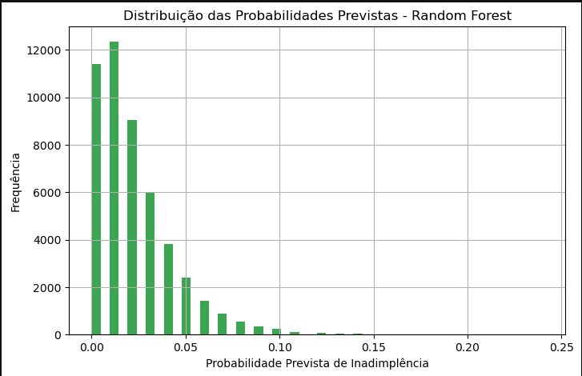
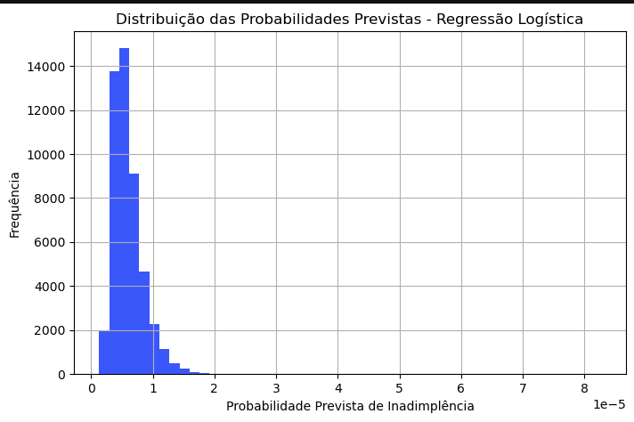
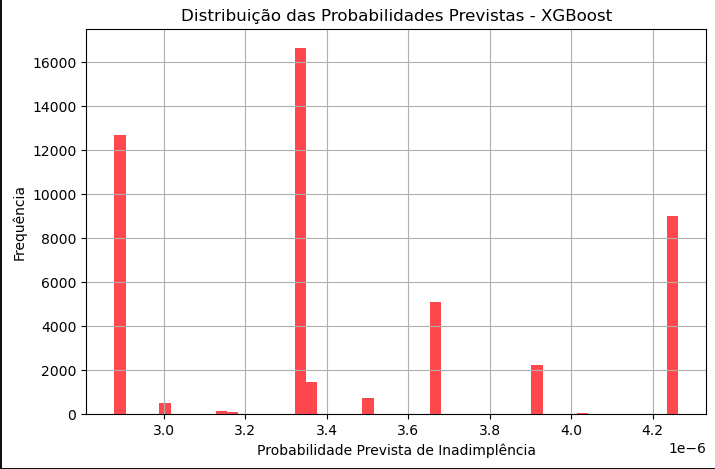

# Análise de Risco de Inadimplência com Machine Learning

Este repositório contém um projeto de análise de risco de inadimplência utilizando técnicas de Machine Learning (ML). O objetivo é prever a probabilidade de inadimplência de clientes de crédito a partir de suas características financeiras, utilizando diversos modelos de aprendizado supervisionado.

## Descrição do Projeto

No campo de ML, a preparação dos dados é uma etapa crucial para obter previsões precisas. Neste projeto, realizamos a limpeza dos dados, a estratificação das variáveis e o uso de técnicas como oversampling (SMOTE) para balancear as classes, garantindo que as previsões sejam consistentes e confiáveis.

Os modelos utilizados incluem:
- **Regressão Logística**: Modelo simples e interpretável, que se mostrou conservador em suas previsões, atribuindo probabilidades de inadimplência próximas de zero para a maioria dos casos.
- **Random Forest**: Modelo que apresentou uma distribuição de probabilidades mais variada, identificando melhor os casos de maior risco.
- **XGBoost**: Um modelo poderoso que, embora semelhante à Regressão Logística em termos de conservadorismo, pode ser ajustado para melhorar sua capacidade de identificar inadimplentes.

As bibliotecas principais utilizadas no projeto incluem:
- **Scikit-Learn** para modelagem e pré-processamento dos dados.
- **Pandas** e **NumPy** para manipulação de dados.
- **Seaborn** e **Matplotlib** para visualização gráfica.
- **TensorFlow** para criação de redes neurais.
- **XGBoost** para modelagem avançada.
- **imblearn (SMOTE)** para balanceamento de classes desbalanceadas.

## Resultados

Os resultados mostram que a escolha do modelo e o ajuste dos hiperparâmetros são essenciais para melhorar a acurácia das previsões. A Random Forest demonstrou ser a mais eficaz ao capturar nuances entre clientes de maior e menor risco, enquanto a Regressão Logística e o XGBoost exigem ajustes para melhorar seu desempenho.

### Visualizações dos Resultados:

1. **Distribuição das Probabilidades Previstas - Regressão Logística**: 
   

2. **Distribuição das Probabilidades Previstas - Random Forest**: 
   

3. **Distribuição das Probabilidades Previstas - XGBoost**: 
   

Esses gráficos mostram como cada modelo distribui as probabilidades de inadimplência para os clientes, revelando diferentes abordagens na identificação de riscos.

## Dataset

O conjunto de dados utilizado neste projeto é o **Home Credit Default Risk**, disponível no Kaggle. Ele contém informações detalhadas sobre clientes de crédito, como características financeiras e histórico de pagamento.

[Link para o Dataset no Kaggle](https://www.kaggle.com/c/home-credit-default-risk)

## Conclusão

Este projeto destaca a importância da preparação dos dados e da escolha adequada de algoritmos para previsões de risco de crédito. A análise de dados e a aplicação de Machine Learning permitem identificar padrões valiosos para a tomada de decisões financeiras, auxiliando instituições a entender melhor o perfil de seus clientes e a gerenciar riscos de forma mais eficiente.
